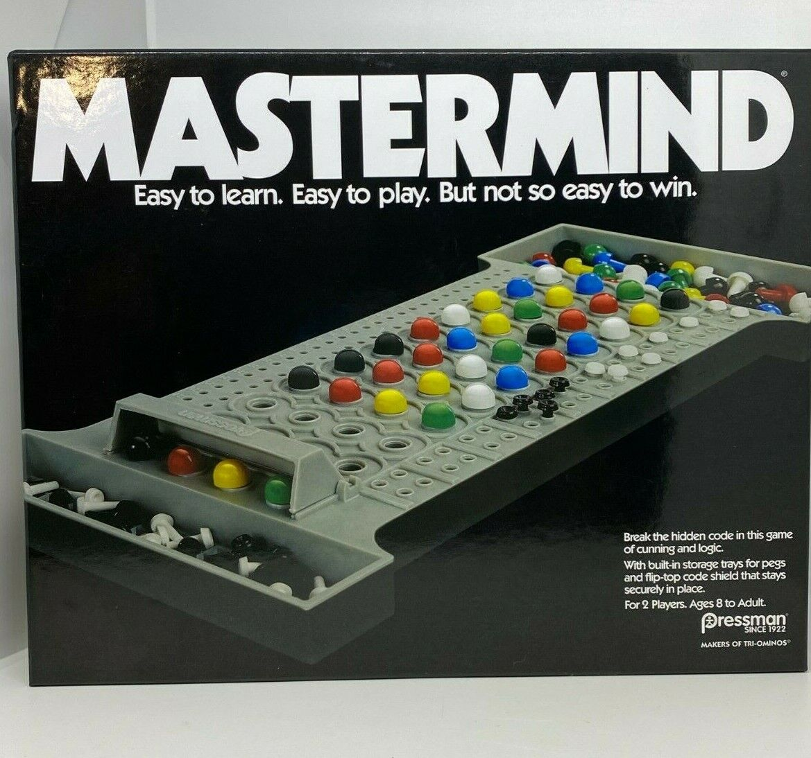

# Mastermind
 


## About This Project

My inspiration for this project was a computer science assignment I received this year in my introduction to computing class where I was required to build a mastermind game, and my professor was giving bonus marks for students who could implement an algorithm to find the secret code in a mastermind game.

I have plans to improve the polish of the program using the python curses module to mimic the board game opposed to using number to represent the colors on the screen. 

## Sources

This was my implementation of an algorithm found in the paper "Efficient solutions for Mastermind using genetic algorithms" written by Lotte Berghman, Dries Goossens, Roel Leus of Katholieke Universiteit Leuven. 

As mentioned in the title of the paper this program leverages genetic algorithms, an entirely new and interesting subject within the field of computer science. This algorithm lets the computer decide the entire generation of guesses while using a fitness function to decide which guesses are the most likely to be the secret code. 

A copy of the paper can be found [here](https://web.archive.org/web/20140909031305/https://lirias.kuleuven.be/bitstream/123456789/164803/1/kbi_0806.pdf).

## Using the program

This program was intentionally created using no libraries outside of the standard python libraries to let others try the program themselves with minimal setup required. To execute the program simply navigate to the directory of the ```mastermind.py``` file and run the command ```python mastermind.py``` on windows and ```python3 mastermind.py``` on linux systems.

Lastly, the study provided two different parameters to tweak (```MAX_SIZE``` and ```MAX_GEN```). The current implementation of the algorithm uses the recommended values given in the paper for a well-rounded combination of performance and accuracy. Please feel free to further experiment with these values for alterations in performance.
